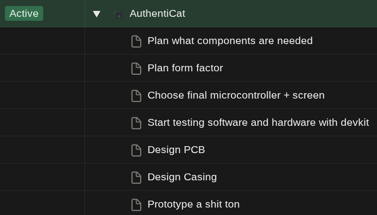

##### Do you ever find yourself on the edge of a self-imposed burnout? Well look no further because my strategy on planning projects might fix it.

So I was on holiday, I was coming up with a ton of cool project ideas, all fun and games. But then I started to count how many project ideas I actually had, at the time I had 12 project ideas I wanted to work on all of them at the same time. And unless you have magical powers that is just not possible nor is it productive.

> “You can do anything, but not everything.” – David Allen

##### My System
My system is based on one simple rule, you set a maximum of projects you will work on and only work on those nothing else. I personally separate my ideas into these 4 categories:
- Active (Max like 3-5)
- Next up (Max about 3-5 as well)
- Ice Box
- Cryo Chamber

Active means you actively work on this project or at least tell yourself you are doing so. Next up means as soon as a spot frees up in active you promote one of these to active (Of course don't force yourself to constantly work on your max amount of projects, it's just a maximum not a minimum). Ice box means you find this idea cool and that you want to build it, just not now. Cryo chamber means you find the idea too cool to trash, but too lame to actually build.

> “Plans are nothing; planning is everything.” – Dwight D. Eisenhower

For each idea I write subtasks for myself, those should be Achievable/Realistic. If you make them too big you will end up never finishing them, and if you make them too small you will end up spending hours making them and ticking them off.

##### Quick Example
For if my way of explaining is too vague, let's create a simple example. This example will be of a real project idea I have but haven't planned yet.

The name of the project is AuthentiCat (I will probably also write a blog about how I come up with names, I'm getting sidetracked back to the example). The idea behind my project is that it is a portable hackable hardware 2FA device with an OLED screen because why not.

First we create an entry in my planner for this (I use notion but you can use whatever you want) I have a slot free and want to work on this project now, so it will be in the active category. Next up I will create a few sub-tasks I can realistically do to get started. Below is a screenshot of how this might look in your planner

##### My takeaways
I think my key takeaway from actually planning projects instead of just having them all in a pile and switching every 5 ms, is that I get a ton more done (Or at least feel like I do). And on top of feeling more productive, I also have more mental peace knowing that I can just focus a few projects and not do them all at once, it may sound strange at first because I'm doing this as a hobby so why do I feel like I have to work on them all. But if you think about it doing something as a hobby is like doing something professionally but instead of money being your reward it is fun (Or at least it should be fun).

> “I treat coding like self-employment, except I’m paid in fun, not money.” - Me

That's all, thanks for reading!